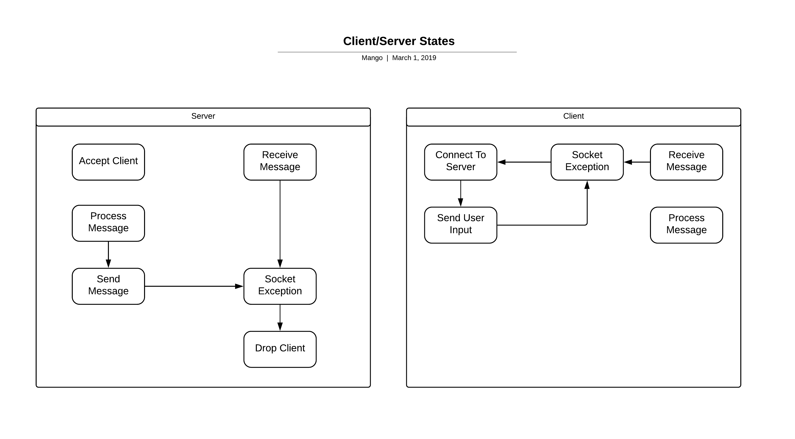
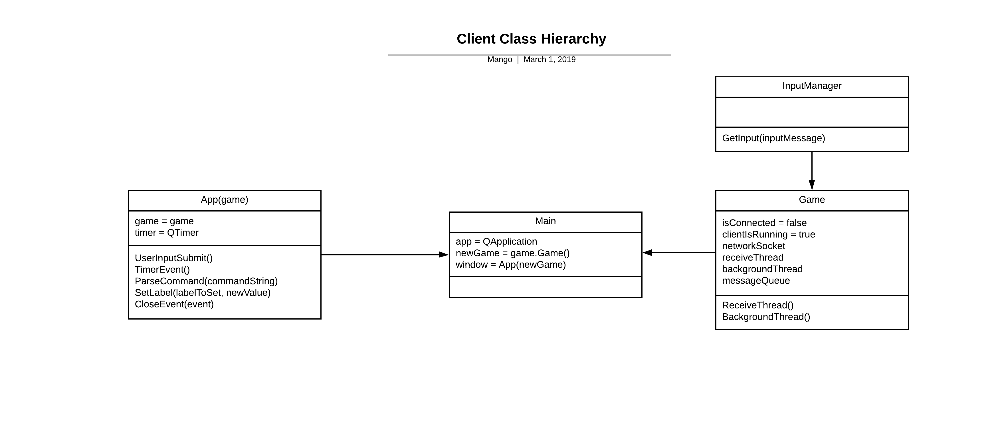

# comp260-server

## Overview
A multi-user dungeon game where the player uses text commands to interact with the world.  

## Controls:  

------------------------------------------------------------------
### General Commands  

Help: Displays this help message.   
Go \<direction>: Move to the room in this direction. Directions are North, East, South and West.  
Look: Look at the room around you.  
Take \<object>: Attempt to take an object or item and add it to your inventory.  
Drop \<object>: Attempt to drop an object or item from your inventory.  
Say: Speak out loud. Other players in the same room will be able to hear you.  

### Inventory Menu:  

Inventory: Displays your inventory.  
Examine \<object>: Attempt to examine an object in your inventory in more detail.  

### Server Commands:  
  
\#name \<newName>: Changes your display name.  

------------------------------------------------------------------

## Design

### State Diagram

### Sequence Diagram

### Server Class Hierarchy

### Client Class Hierarchy

### UI Wireframe Mockup

